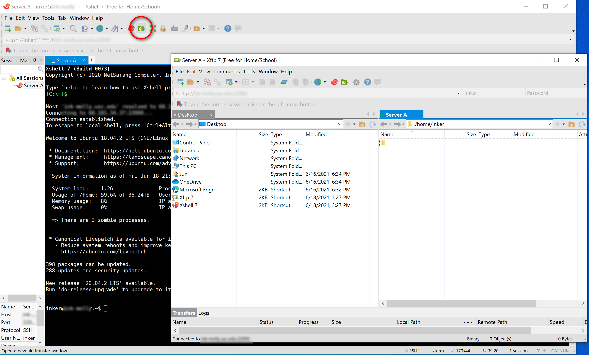
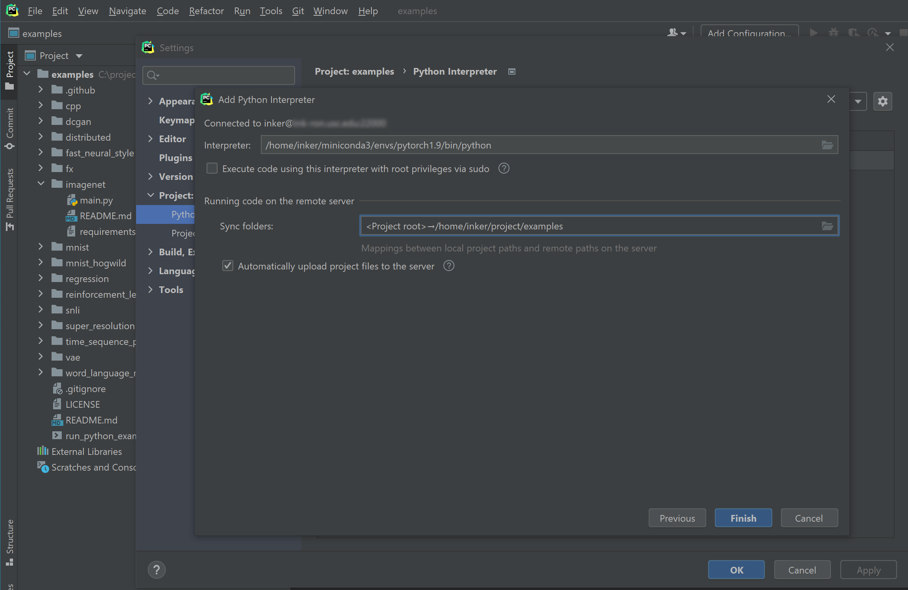
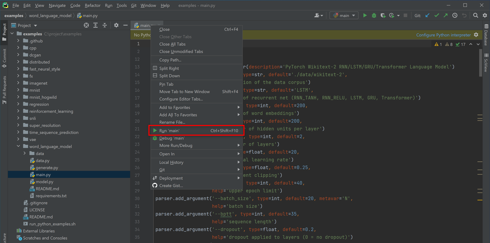
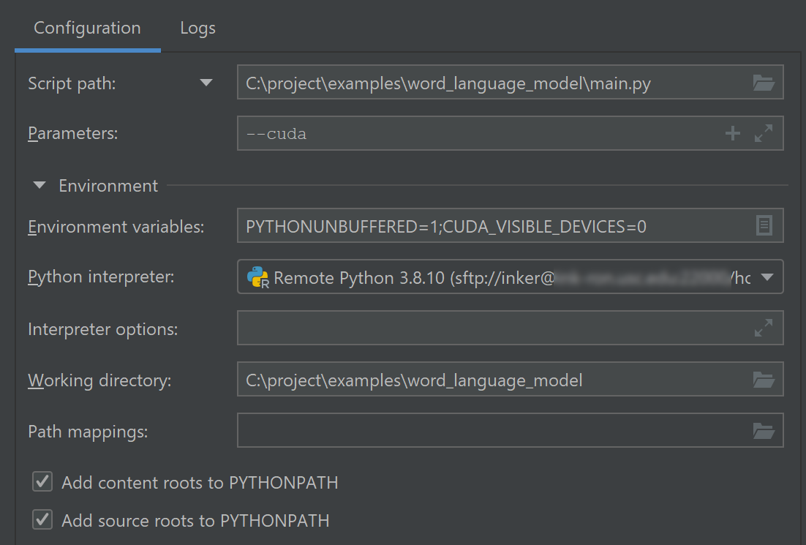
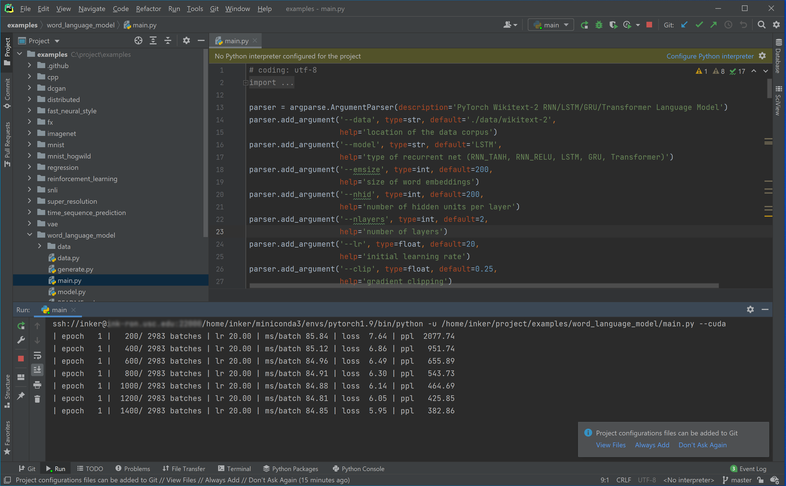
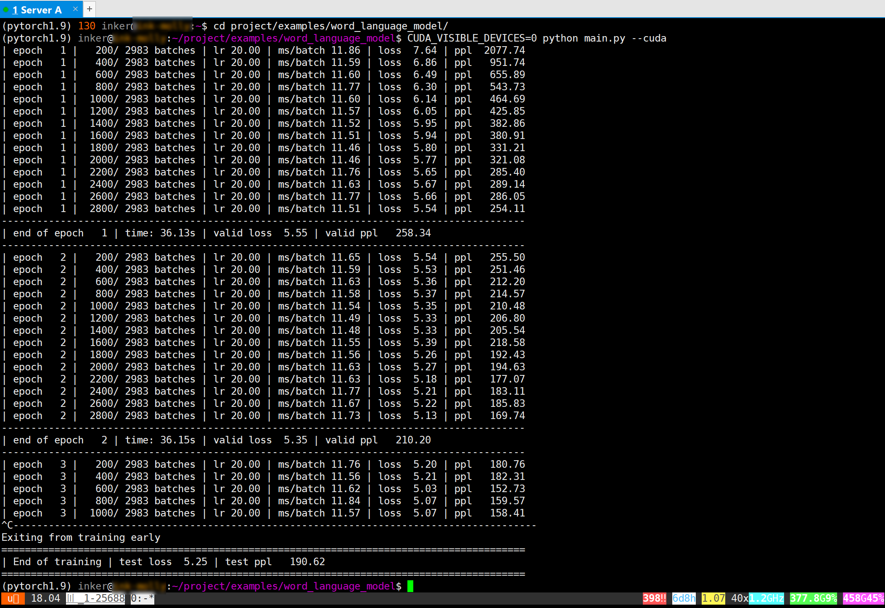
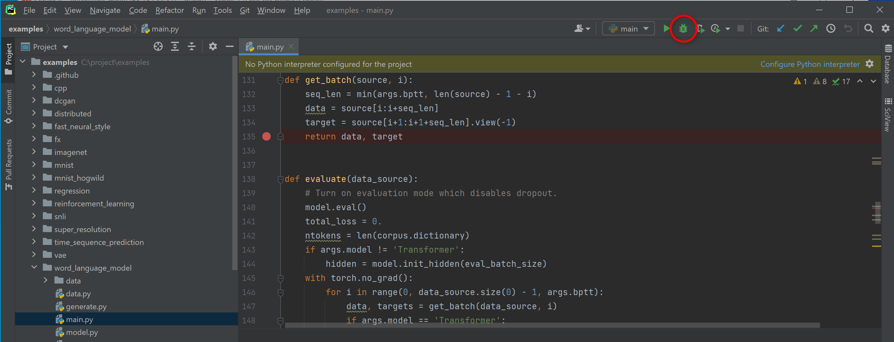
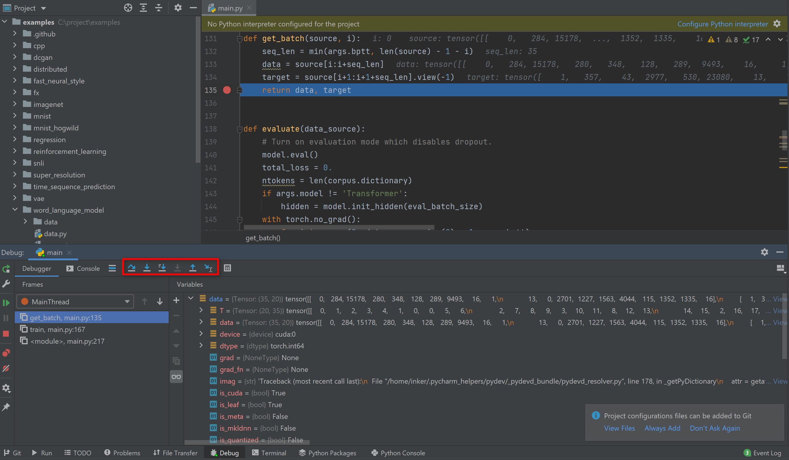
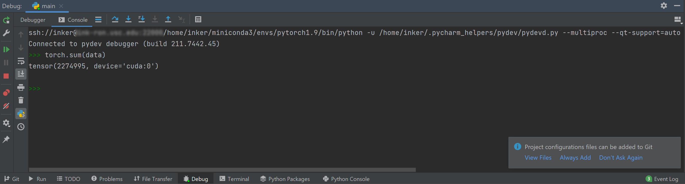

# Get Started on Deep Learning Experiments on GPU Servers

This tutorial is for interns at INK lab. I will go through the basic procedures of developing and running deep learning models on GPU servers. Here I just introduce the procedure that I personally feel friendly for beginners. Suggestions and contributions are welcome.

I use Windows 10 in this tutorial and I assume you already have:

- The connection information (host, port, username, password) for a remote GPU server, which can be connected via SSH;
- An edu email address or proof documents, which is needed for getting a license for the professional version of PyCharm with the remote development feature.


## Set up SSH/SFTP clients for connecting to the servers

As Windows doesn't come with native SSH/SFTP support, we use XShell and XFTP as clients for SSH/SFTP.

1. Download and install both XShell and XFTP at https://www.netsarang.com/en/free-for-home-school/.

2. Start XShell and create sessions.

   - File → New. Enter the `Host` and the `Port Number` of your server. Give it a `Name` that you like. Go to the **Authentication** under the **Connection** category at the left side. Enter your `User Name` and `Password`. Click "OK". 

   - Double click the server name in the session manager to start a SSH connection (press "Accept and Save" on the pop-up warning). Once the connection is established, click the "XFTP" icon to start a SFTP connection. You can execute commands in XShell and transfer files between your computer and the server in XFTP.

     


## Set up the remote environment 

1. Set up byobu (or tmux/screen) so that your running process can be maintained after you end SSH session. Execute below commands after you connect to the server in XShell.

   `byobu`

   `byobu-enable`

   You can use F2, F3, F4 to create new window and move focus among windows. Execute `exit` to close a window. Check https://gist.github.com/devhero/7b9a7281db0ac4ba683f for a cheetsheet for byobu.

2.  We have a global conda environment for all users but it's not very convenient. So download a miniconda to set up your own conda environment.

   We choose `Miniconda3 Linux 64-bit` with `Python 3.8` on https://docs.conda.io/en/latest/miniconda.html.

   `wget https://repo.anaconda.com/miniconda/Miniconda3-latest-Linux-x86_64.sh`

   `bash Miniconda3-latest-Linux-x86_64.sh`

   Enter `yes` for the following prompt:

   ```
   Do you wish the installer to initialize Miniconda3
   by running conda init? [yes|no]
   [no] >>> yes
   ```

   Reinitialize the current session by disconnecting and reconnecting to the server.

   Use `which conda` to confirm that you are under your own conda environment now.

   ```
   (base) inker@ink-server:~$ which conda
   /home/inker/miniconda3/bin/conda
   ```

   Here `base` is the name of the default conda environment.

3. Usually you can have multiple projects that require different dependencies, so it's good practice to create one conda environment for your daily coding, and create one environment for each individual project. Here as a example, we create an environment named `pytorch1.9` with Python 3.8 and install PyTorch 1.9.0 in it. (You can find a cheat sheet for conda at https://docs.conda.io/projects/conda/en/latest/user-guide/cheatsheet.html)

   `conda create -n pytorch1.9 python=3.8`

   Then switch to the `pytorch1.9` environment with `conda activate` and confirm the path for the python interpreter.

   ```
   (base) inker@ink-server:~$ conda activate pytorch1.9
   (pytorch1.9) inker@ink-server:~$ which python
   /home/inker/miniconda3/envs/pytorch1.9/bin/python
   ```

   Next we install PyTorch 1.9.0 using the command shown in https://pytorch.org/.

   ```
   conda install pytorch torchvision torchaudio cudatoolkit=10.1 -c pytorch
   ```

   * We change the cudatookit version from 10.2 to 10.1 to be compatible with the GPU driver installed on the server.

   Test if GPU can be detected by pytorch.

   ```
   (pytorch1.9) inker@ink-server:~$ python
   Python 3.8.10 (default, Jun  4 2021, 15:09:15) 
   [GCC 7.5.0] :: Anaconda, Inc. on linux
   Type "help", "copyright", "credits" or "license" for more information.
   >>> import torch
   >>> torch.cuda.is_available()
   True
   ```

   Use Ctrl+D to exit the python interpreter.

4. Check the GPU status using `gpustats` (if installed by the server admin) or `nvidia-smi`.

   - Usually you shouldn't run your job on GPUs that have already been occupied by others.

   

## Install Git and clone a repository

It's common to start your code on top of others' code. Here we show you how to download code for a github repository.

1. Download and install git from https://git-scm.com/downloads.

2. As an example, we show you how to clone the code of official PyTorch examples to your local computer.

   - Open a local folder where you want to store your project, e.g. `C:\project`.

   - Right click → `Git Bash Here`.

   - Click the `Code` button on https://github.com/pytorch/examples and copy the HTTPS URL (https://github.com/pytorch/examples.git) for their git repository.

   - In Git Bash, run `https://github.com/pytorch/examples.git`. You will then find the `examples` folder downloaded to `C:\Project`. The `examples` folder contains the code you saw in https://github.com/pytorch/examples.

     

## Set up PyCharm for remote debugging and automatic deployment

Here we show you how to set up PyCharm (a IDE for python) to play with the downloaded code: working on the code locally and running/debugging it on the server.

1. Download and start PyCharm (Professional) at https://www.jetbrains.com/pycharm/download.

   - You can get a free license for the learning purpose from https://www.jetbrains.com/shop/eform/students using your edu email adress or official documents. Before you get a license, you can have a free trial for 30 days.

2. Open the folder that contains the code in PyCharm: `C:\project\examples`.

3. Connect to the server in PyCharm to set up remote debugging and automatic deployment.

   - File → Settings → Project: examples → Python Interpreter → click the gear icon → Add → SSH Interpreter

   - Enter the `Host`, `Port` of your server, and enter the `Username` of your account. Click "Next". Click "Yes" on the popup window showing the fingerprint of the server.

   - Enter your `Password`. Click "Next".

   - For the interpreter, enter the path to the python interpreter of the conda environment that you want to work with. Previously we have got the path `/home/inker/miniconda3/envs/pytorch1.9/bin/python` by executing `which python` in the created `pytorch1.9`  environment.

     Also specify a folder (which doesn't need to exist now) on the server that you want to sync your code to. Here we choose `/home/inker/project/examples`, which is under the user's home directory.

     

     Click "Finish" → "OK". After the configuration, you can write the code in PyCharm, and it will be automatically uploaded to the server, so that you can run/debug code in PyCharm using the server resources.

4. Now let's try to run the code for word language modeling.

   - Open the `examples/word_language_modeling/main.py` shown in the left Project window.

   - Right click the tab and select "Run ...".

     

   - Choose the remote `Python interpreter` you just configured. Pass any `Parameters` needed by the python script. Also you can set `Environment Variables` here. We set `CUDA_VISIBLE_DEVICES=0` to let the program only use the first GPU on the server.

     

5. Click "Run" and you will see the console output below.

   

   This is equivalent to running jobs in the shell in XShell. Usually we run jobs in the shell because they can take very long time to finish. We can just leave them running even if we shut down out computer because byobu can maintain the running sessions.

   

6. Now let's try to debug the code.

   - Add a breakpoint to the line that you want to look into, and click the "debug" button that is next to the "start" button. The program will run and pause at the breakpoint for your inspection.

     

   - You can "step over" / "step into" / "step out" the code.

     

   - You can also execute commands in the interactive python shell to do more analysis or even try coding a few more lines.

     

7. Be careful about syncing your local code with the remote code, so that you won't run or debug a wrong version of the code with PyCharm. You can check the deployment configuration at: File → Settings → Build, Execution, Deployment → Deployment → Options. Check the value for "Upload changed files automatically to the default server".

   - The default server is set in File → Settings → Build, Execution, Deployment → Deployment using ✔.

## Manage your code with git


## Guidance for running jobs on servers

- Please check the GPU utilization (by `gpustat` or `nvidia-smi`) of the server before running your job. Specify the GPU id of your job by running with `CUDA_VISIBLE_DEVICES=X python xxx.py` to assign your job to certain gpu(s).
- Some servers use job scheduling system like Slurm. For those servers, you **shouldn't** directly run a GPU job from IDE or shell. You **should always** submit your jobs with slurm commands.
